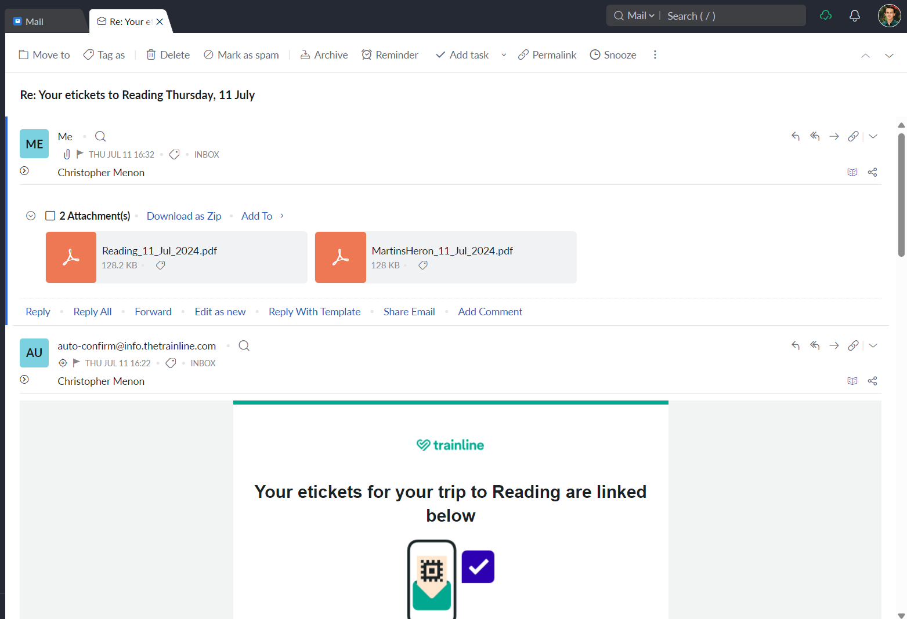

# download-trainline-tickets
This is a Python script that scans your emails for links to Trainline tickets and downloads the PDFs.

## Description
Trainline doesn't always attach digital train tickets to its emails, sometimes you have to click on a link and download the tickets from its website. This script scans your inbox using IMAP for recent emails from Trainline with links to train tickets, and adds them to your inbox.

Tickets are uploaded to the inbox as PDF attachments to an email that replies to the original Trainline email. The email is added silently and marked as read.

Tickets can also be sent to other devices using [Pushbullet](https://www.pushbullet.com/). 

Once an email has been processed, its unique ID, subject, and date are stored in a JSON file, `completed_messages.json`, to prevent duplicate downloads. This file is created in the same directory as the script.

## Installation & Setup

1. Clone the repository and install [Python 3.11](https://www.python.org/downloads/) and the requirements in [`requirements.txt`](requirements.txt) (e.g. using `pip install -r requirements.txt`).
2. Rename `config-template.ini` to `config.ini` and fill in the fields.
    - Set the pushbullet settings to `false` to disable it.

## Usage

Run the script using `python -m download_tickets -a "14 days"`. You can replace `14 days` with any human-readable length of time. Use a sufficiently large value (e.g. `"999 years"` to download all past  tickets). It runs completely in the terminal and will exit when it's done.